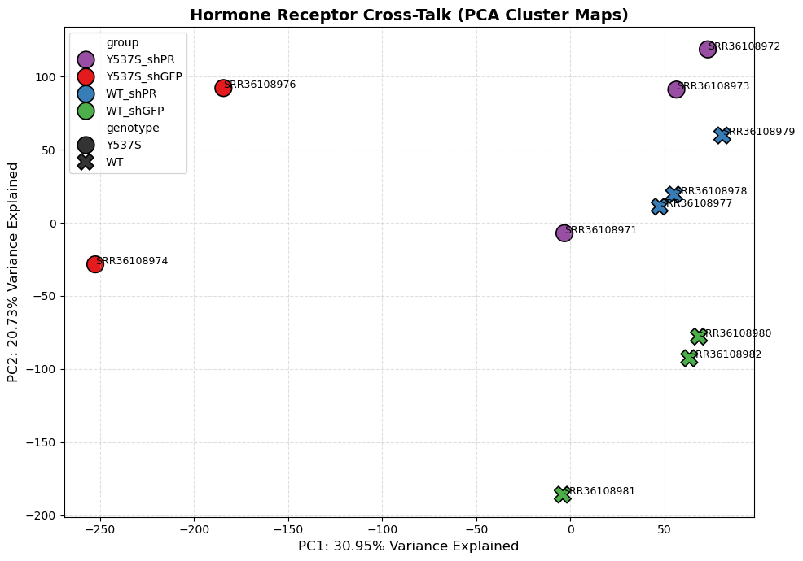
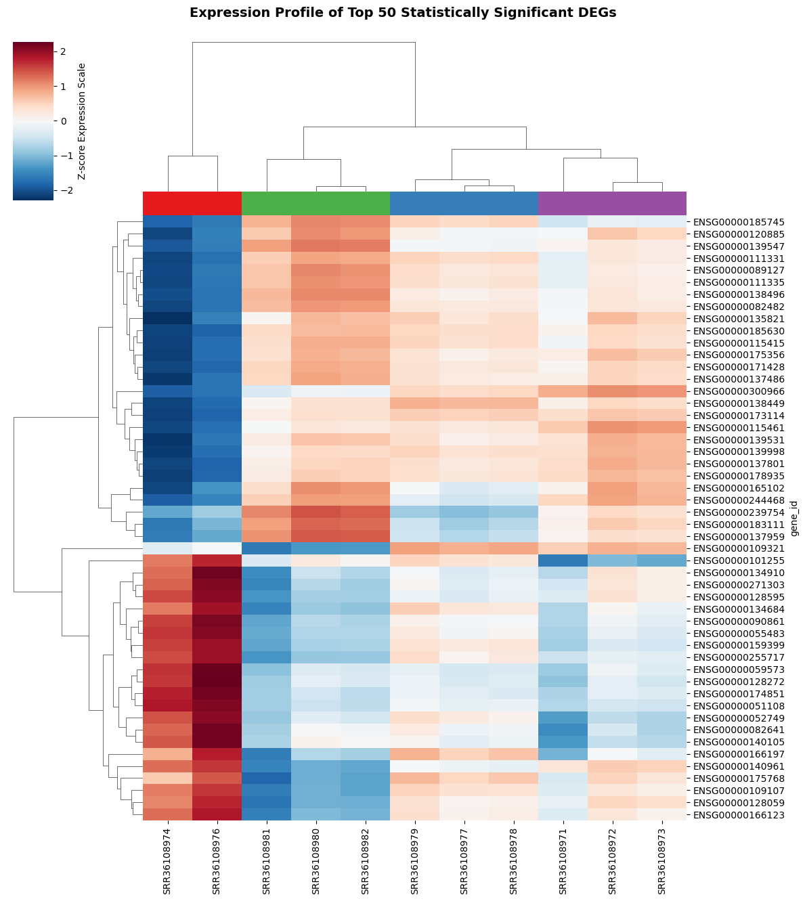
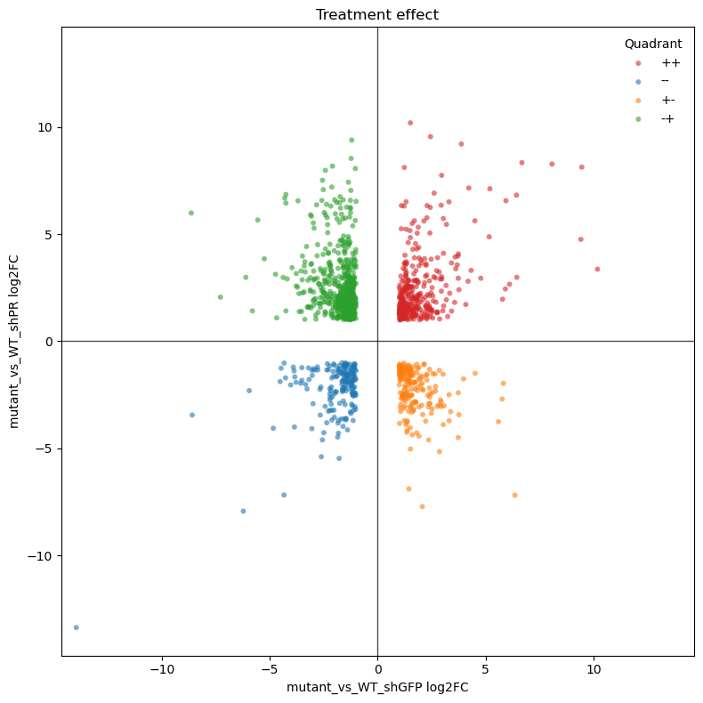

# Does Losing Progesterone Receptor Alter ER+ Breast Cancer Transcriptome?

## Problem

- Breast cancer is the most common cancer among women. Over 70% of breast cancers are Estrogen Receptor-positive (ER+), meaning they use estrogen as fuel to grow.
- While standard treatments effectively block this fuel, many advanced cancers eventually learn to grow without it by developing ER mutations like ESR1. 
- Y537S is an acquired somatic mutation that emerges in metastatic disease following long-term treatment with aromatase inhibitors meant to deplete systemic estrogen.
- Because the Y537S mutation causes estrogen receptor (ER) to be constitutively on even without estrogen, standard estrogen-starvation methods fail against it as the tumors become independent of estrogen, leaving doctors with fewer effective options to stop the spread.

- This project uses publicly available RNA-seq data (Truong et al. (2026)) to understand the role of Progesterone Receptor (PR) in advanced endocrine-resistant breast cancer, specifically in cells harboring ESR1 mutation, Y537S. 
- The data was obtained from a 2x2 factorial design using WT ER+ and ER+ Y537S mutants under control (normal PR) vs treatment (PR has been knocked down).


## Key Insights 

## PR Knockdown Rescues Y537S Transcriptome to WT-Like Signature

Global similarity analysis across all expressed genes show that the biggest source of variance is the presence or absence of PR within the mutant background, and that removing PR makes the mutant samples move closer to the WT cluster. PR is an ER target gene which is regulated by estrogen. Because PR is directly upregulated by functional ER, the presence of PR in a breast cancer tumor acts as an excellent indicator that the ER pathway is active and functioning. This implies that PR may help sustain the mutant-specific transcriptional state. When PR is removed from ESR1-mutant cells, they lose that mutant-distinct signature and become more WT-like at the transcriptome level.



PR has been indicated as the primary driver of aggression in the context of mutant ER+ breast cances. Specifically, when PR is activated, it regulates transcriptional programs associated with more aggressive phenotypes such as invasion, stem-like features, and circulating tumor cells; enabling the cancers to spread and colonize distant organs like the brain and lungs.


Indeed, hierarchical clustering of top 50 significant genes (based on adjusted p-value) in interaction contrast reveals two distinct therapeutic axes governed by the ESR1-Y537S interaction model.


 


**1. The PR-Repressed**
    
The top cluster represent genes strongly repressed by Y537S mutation (red column on the left) but remain moderately turned on in WT control (green column). When PR is knocked down in the mutant background **(purple column)**, the expression profile of these genes is similar to that of WT ER. The Y537S mutation effectively shuts these genes down but knocking down PR a
rescues them to the WT state.


**2. The Mutant-Driven / PR-Dependent**

Conversely, the bottom cluster identifies constitutively active mutant driver genes (Deep Red) that are selectively neutralized and turned off upon PR knockdown, demonstrating a targeted reversal of the mutant phenotype. These genes represent the core oncogenes, "Aggressive Cancer Program" turned on by the constitutive Y537S Estrogen Receptor mutation. They are being hyper-activated to drive cell proliferation and tumor growth while remaining inactive in WT control samples **(green column)**, meaning they are turned on exclusively by the ESR1 mutation. Because knocking down PR successfully forces these hyper-activated oncogenes (bottom block) to cool down and match the wild-type signature, it suggests that they require both Y537S mutation plus PR to be activated.  

This group of genes represent prime candidates for primary therapeutic target. The Y537S mutation turns them genes on to drive cancer growth, but knocking down PR selectively neutralizes them, crashing their expression back down exclusively in the mutant cells.

---


### PR Knockdown Inverts Mutant-Specific Transcriptional Profiles

A cross-contrast comparison of the Y537S mutation effect at baseline (shGFP) versus post-treatment (PR knockdown) reveals a widespread transcriptional inversion. 

The high concentration of candidates in the **'-+' (Green) and '+-' (Orange)** quadrants demonstrates that removing PR does not merely mute mutant signaling; 
    - It actively reverses the direction of differential expression for a major subset of mutant-driven genes, making them prime targets for therapeutic rescue.

**The Massive Reversal Effect (Green & Orange):** The high density of genes in the Top-Left (Green) and Bottom-Right (Orange) quadrants shows that knocking down PR completely flips the behavior of mutant cells. The **Orange (+-)** genes turned ON by the mutation at baseline, but repressed far below wild-type levels once PR is removed. **Green (-+)** genes suppressed (OFF) by the mutation at baseline, but hyper-activated far above wild-type levels post-PR knockdown. 

**The Treatment-Resistant Genes (Red & Blue):** Genes in the Top-Right (Red) and Bottom-Left (Blue) represent pathways where the mutation remains dominant. Despite knocking down PR, these genes remain abnormally elevated or suppressed in the mutant cells.





### PR Knockdown Dismantles Y537S Mutant Cell's Survival Infrastructure

GO enrichment analysis of genes exhibiting a significant ESR1 mutation × PR knockdown interaction revealed coordinated downregulation of pathways involved in endoplasmic reticulum homeostasis, including the unfolded protein response (UPR), ER-associated degradation (ERAD), protein folding, proteasomal degradation, and ER stress-induced apoptosis. ESR1 mutant breast cancers are high-performance engines that produce lots of proteins to maintain aggressive growth, experience chronic proteotoxic stress, and often rely on the UPR to survive. PR loss suppresses this adaptive stress program specifically in Y537S cells. 

ESR1 mutant breast cancers also require efficient ER-Golgi trafficking. Multiple pathways related to vesicle-mediated transport and COPII cargo loading such as ER-to-Golgi trafficking, COPII vesicle cargo loading, Golgi organization, and protein transport are downregulated in Y537S-PR knockdown. Loss of these pathways suggest reduced protein secretion, impaired membrane trafficking, altered receptor recycling, and disturbed proteostasis. The cell's delivery system of the cell have stopped working; proteins can no longer be shipped from the production line (ER) to their destinations (Golgi/Cell Membrane).

Besides, the survival backup (Autophagy) pathways like autophagosome assembly and organization are downregulated. Autophagy is a recycling survival mechanism that cells use to eat their own damaged parts to stay alive during stress and ESR1 mutant tumors often use autophagy to survive estrogen deprivation. Suppressing these pathways may indicate reduced stress adaptation, 
impaired recycling, and altered metabolic fitness. By shutting this down, the mutant cell loses its last-resort safety net

Lastly, the network of protein quality control is suppressed with PR knockdown in Y537S cells including proteasomal protein catabolism, ERAD, protein folding, and chaperone-dependent folding. PR knockdown gives the cell less capacity to properly fold and degrade proteins. 

In contrast, upregulated pathways are dominated by antiviral/interferon-associated biological processes like negative regulation of viral genome replication and viral process,  and IL-27-mediated signaling. These pathways are classic signatures of interferon activation. Upregulation suggests that PR knockdown is "tripping an alarm" that might make these mutant cells suddenly visible and vulnerable to the immune system. My analysis shows that when PR is knocked down, every major system required to manage this high workload shuts down. PR loss suppresses this adaptive stress program specifically in Y537S cells.


### Compensatory Proteostasis: Selective Induction of PSMB8

Notably, **PSMB8** was strongly induced (**18.2 log2FC**) in ESR1 mutation × PR knockdown interaction despite belonging to the otherwise downregulated proteasomal protein catabolic process, suggesting a pathway-level suppression with a gene-specific compensatory response. PSMB8 is a core component of the immunoproteasome, a specialized "emergency" version of the garbage disposal that the cell only builds under extreme stress or during an immune response. PR has been reported to have anti-inflammatory functions in some breast cancer contexts. Loss of PR could therefore release interferon-associated transcription, especially in the ESR1 mutant background. Selective induction of PSMB8, together with enrichment of IL-27 and antiviral pathways, suggest activation of an interferon-driven immunoproteasome response rather than maintenance of the standard proteasome machinery.


Collectively, these results confirm that in the context of mutant ER, PR regulates a distinct set of genes compared to wild-type ER.

----


## Analysis Steps

### 1. Create a Virtual Environment and Install dependencies
```bash
conda env create -f environment.yml
conda activate rnaseq-python-pipeline
```

### 2. navigate to the folder with .fastq.gz files
```bash
cd /path/to/your/fastq/files
```

### 3. Initial Quality Check

run the script
```bash
bash raw_reads_qc.sh
```

### 4.  Quality Trimming (fastp/Trimmomatic)

```bash
python run_fastp_pipeline.py
```

### 5. Alignment / Pseudo-Alignment

```bash
#using salmom
# download human transcriptome sequence file (.fa or .fasta) from GENCODE
#the run: to create the transcriptome_index
salmon index -t gencode.v50.transcripts.fa.gz -i human_transcriptome_index

# run alignment with salmon
python run_salmon_pipeline.py
```

### 6. Collapse read counts to gene level

Salmon quantifies at the transcript level (each isoform separately), use pytximport / pymportx in python to collapse that to gene-level counts before DESeq2.

```bash
# using pytximport
python3 collapse_salmon_counts.py
```


### 7. QC/Exploratory Analyses

Open basic_EDA.ipynb for PCA and sample-to-sample distance heatmap

### 8. Get Gene Symbols

This is to create gene annotation data to later use the gene symbols especially for pathway enrichment analysis. I did this at the in basic EDA notebook.

### 9. Differential Gene Expression

- This is a 2 X 2 factorial experiment. So the script fits a single interaction-aware model:
    ~ genotype + treatment + genotype:treatment term. 

```bash
#using pydeseq2 
python fit_deseq2.py
# extract contrasts
python extract_contrasts.py
```

### 10. Visualization

- DEGs are visualized in visualization.ipynb: Here you will find:
    - Volcano plot
    - Venn Diagram
    - Heatmap of top DEGs 

### 11. GO Enrichment

- To find significantly enriched pathways for upregulated and downregulated genes, I used gseapy

## Clone the repo:

```bash
git clone https://github.com/machaniG/er-pr-breast-cancer-transcriptome.git